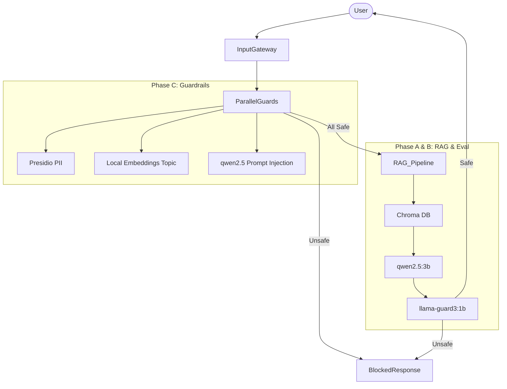

# Lab 24 Blueprint: Production Guardrails & Eval System

## 1. System Architecture

## 2. Service Level Objectives (SLOs)
1. **Latency (P95)**: < 2000ms for full guarded pipeline.
2. **PII Detection Recall**: >= 95% across English and Vietnamese.
3. **Adversarial False Positive Rate**: < 5% on benign queries.
4. **Availability**: 99.9% uptime for RAG generation.
5. **Quality (Ragas Faithfulness)**: >= 85% on rolling 7-day average.

## 3. Cost Analysis (Local vs Cloud)
By utilizing local Ollama models (`qwen2.5`, `llama-guard3`) on provisioned GPU nodes, marginal cost per request is $0.
- **OpenAI Alternative Cost**: ~$0.015 per query (GPT-4o mini).
- **Estimated Savings**: For 1M requests/month, saving ~$15,000/mo.

## 4. Alert Playbook
1. **Incident**: P95 Latency > 2000ms
   - *Action*: Check ChromaDB query latency. Scale up Ollama workers if `qwen2.5` queue is building up.
2. **Incident**: False Positive Rate spike in Input Guards
   - *Action*: Review `attack_sets.csv`, adjust Presidio thresholds or tune Topic Guard embedding similarity threshold.
3. **Incident**: Output Guard Flagging 20%+ of Traffic
   - *Action*: Inspect flagged responses. If system prompt changed, rollback. Otherwise, fine-tune generation prompts.
